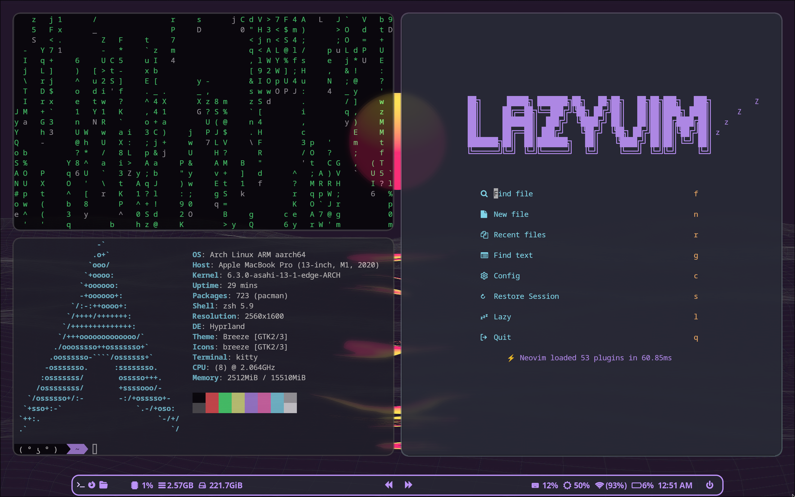

# Hazumino Dot Files

### Packages:
- [fuzzel](https://codeberg.org/dnkl/fuzzel) 
- [rofi](https://github.com/davatorium/rofi)
- [grim](https://github.com/emersion/grim) & [slurp](https://github.com/emersion/slurp)
- [kitty](https://github.com/kovidgoyal/kitty)
- [vifm](https://github.com/vifm/vifm)
- [swww](https://github.com/Horus645/swww) 
- [tmux](https://github.com/tmux/tmux/wiki)
- [nvim](https://github.com/neovim/neovim)

### Waybar Functions
#### Left Side
- Workspaces are divided in three sections (Terminal, Browser, File Manager)
- Cpu usage
- Memory
- Storage remaining

#### Center
- Change Wallpaper (Backward)
- Change Wallpaper (Forward)
**NOTE**: Transitions can be modified in the swww.sh file

#### Right Side
- Keyboard Backlight (Scroll up and down to modify)
- Screen Backlight (Scroll up and down to modify)
- Wifi (Uses NetworkManager TUI)
- Battery Level
- Clock
- PowerMenu (Uses rofi)

### Screenshot

### Note
This setup has asahi linux in mind, thus some tinkering may be necessary if other devices are utilised.
